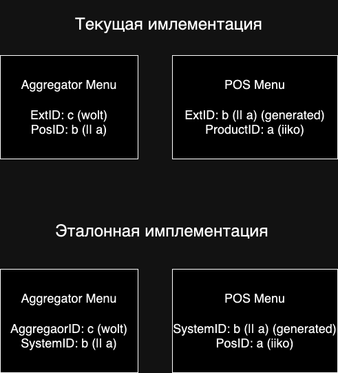

### Mocks

#### Installation
Install [Mockery](https://pkg.go.dev/github.com/vektra/mockery/v3) first:

##### Install Go package
```
go install github.com/vektra/mockery/v2@latest
```

##### Install mockery application

###### Ubuntu
```
sudo apt-get -y install mockery
```

###### MacOS
```
brew install mockery
```

#### Create mock
To create mocks of interface use the command:
```
mockery --name {interfaceName}
```

#### Set annotation to grafana dashboard
```
make prerelease-integration-api DESCRIPTION="prerelease-integration-api deploy with version v-release-1.37"
```

## Business logic

### Product id fields


## Стоп-листы
### Проблема
Изначальное состояние продукта следующее: `available = true` и `is_disabled = false`.
<br/>
Крон выключает продукт. Тогда состояние продукта станет следующим: `available = false` и `is_disabled = true`.
<br/>
Пришел веб-хук о том, что продукт на кассе закончился. Состояние продукта следующее: `available = false` и `is_disabled = true`.
<br/>
Крон включает продукт. Тогда состояние продукта следующее: `available = true` и `is_disabled = false`.
<br/>
Мы получаем неверное состояние, т.к. продукт на кассе недоступен, но крон сделали его доступным.

### Решение
В данный момент для хранения состояния продукта у нас есть 2 поля: `available` и `is_disabled`.
<br/>
Для решения проблемы нужно хранить 3 поля: `available_pos`, `available_aggregator` и `is_cron_enabled`.
<br/>

##### Сценарии использования

###### Вебхуки от кассы
Когда приходит вебхук от кассы, то:
- `available_pos` меняем всегда
- `is_cron_enabled` не меняем никогда
- `available_aggregator` меняем по условию. Если `is_ignore_pos = true`, то ничего не делаем. Иначе - `available_aggregator = available_pos`

###### Крон
Когда срабатывает крон, то:
- `available_pos` не меняем никогда
- `is_cron_enabled` меняем всегда
- `available_aggregator` меняем по условию. Если `available_pos = false`, то ничего не делаем. Иначе - значение `available_aggregator` ставим согласно крону

Возможно, необходимо добавить еще одно поле `is_admin_enabled` для управления стоп-листом из админки. Тогда добавится еще один сценарий - управление стоп-листом из админ-панели, и логика усложнится.

#####  Jq – это мощный инструмент, позволяющий читать, фильтровать и писать JSON в bash.
```
brew install jq
```
